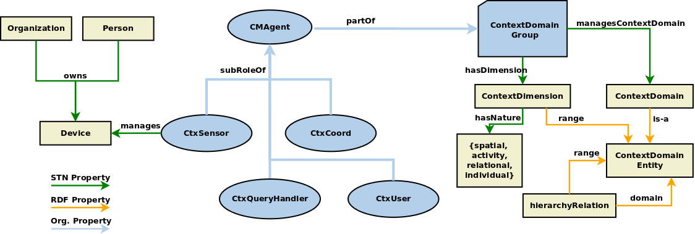

Concepts
========

### ContextDimension

A **ContextDimension** is a binary assertion (i.e. a _predicate_ defined over a _subject_ or an _object_) that specifies a _direction_ along which to define _the focus_
of a context-aware application.

A very common example is a _spatial_ dimension (e.g. _locatedIn(Person, UniversityRoom)_, _locatedIn(Person, PublicTransportVehicle)_).
This means that the main focus of the application **shifts** as a consequence of _change_ in the **object** of a spatial relation. For example, when changing _UniversityRoom_ instances (e.g. going from a lecture hall to a lab), the interest in context information (sensors, available smart devices, etc) changes, _as a consequence_ of changing the rooms.

Alternatively, the main dimension which determines a change in the application behavior may be one related to the current _activity_ of a person. A predicate such as _engagedIn(UniversityPersonell, AcademicActivity)_ denotes the fact that shifts of attention happen when the _AcademicActivity_ instance changes (e.g. from research to teaching).

### ContextDomain

A **ContextDomain** is associated to a **ContextDimension** and denotes the _type_ of the object instances that constitute a current _context focus_. In the examples given above, _UniversityRoom_ and _AcademicActivity_ are **ContextDomain types** and _Lab308_ or _KRR-Lecture_ are **ContextDomain instances** for the _locatedIn(Person, UniversityRoom)_ and _engagedIn(UniversityPersonell, AcademicActivity)_ ContextDimensions, respectively.

### ContextManagement Agents

When an application defines its context interest/focus in the manner described above, there are a set of _management entities_ that naturally come up.
* The **SensorAgent** is a management unit that handles the _sensor_ and _actuator_ information of _real_ (e.g. motion sensors, RGB cameras, smart lights, smart blinds) or _virtual_ (e.g. a log queue, a Twitter feed) smart sensing/acutation devices.
The SensorAgent is responsible with maintaining device status (including _availability_), as well as providing a **web-protocol** based interface for actuating the device or subscribing to device events. The SensorAgent implements wrappers over sensor/device specific APIs that allow communication with the sensor/device.

* The **UserAgent** is a client-side wrapper unit that enables an application to define its _context interest/focus_, create/cancel queries and subscriptions, perform authentication operations.

* The **CoordinatorAgent** is a processing unit that is in charge of coordinating _a set_ of SensorAgents and UserAgents that are focused on a given ContextDomain.

### ContextDomainGroup

All ContextManagement Agents are centered on handling the exchange of information pertaining to one _context focus_. Since the _context focus_ is defined in terms of a _ContextDomain_, all ContextManagement Agents that are focused on the same ContextDomain are part of a _ContextDomainGroup_. 
_Membership_ in the group implies _interest_ in the context information shared in the group.

Membership can be:
- _explicitely_ requested: e.g. a retailer asking to be allowed access to a _monitorsConsumption(Application, FoodItem)_ ContextDomainGroup of a user owning a smart fridge that can track the products the user has in storage. The ContextDimension is of an _activity_ type and the _ContextDomain_ type can be, for example, a subclass of FoodItem, such as _DairyProduct_. Membership in the ContextDomainGroup will allow the the retailer application to issue queries for its own brands of DairyProducts.

- _implicitly_ determined: e.g. physical presence in a UniversityRoom automatically makes a person a member of the _ContextDomainGroup_ associated with that room (e.g. Lab308); ownership of the smart fridge automatically entitles the SmartFridge app running on the user smartphone to join the _monitorsConsumption(Application, FoodItem)_ ContextDomainGroup.

The above mentioned concepts are presented graphically in the Figure below.

---------------------------------------------------------------------------

